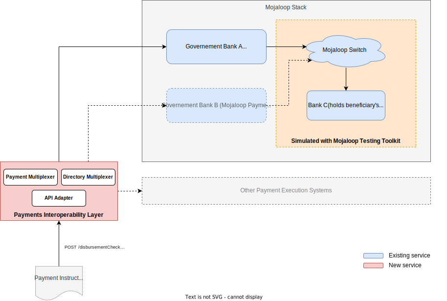

## PoC for initiating a G2P (Government to Person) payment through mojaloop switch

This is PoC for a G2P payment using a sample implementation of `Payments Interoperability Layer`.

This uses the following components
- DFSP payment manager - As a sender FSP implementation
- Mojaloop Testing Toolkit - Simulates the Mojaloop switch and receiver FSP

### Technical Architecture


### Implementation Notes

- The `Payments Interoperability Layer` consists of many sub components like `Payment Multiplexer`, `Directory Multiplexer`...etc which usually run as individual services in a cluster environment. But for PoC a single consolidated service is implemented.
- Though the folders and files are properly named to suite the component names.
- In the real implementations these components can be individual services which communicate each other by means of a messaging system like kafka and a caching system like redis.

### Deployment Instructions

- Clone this repository
- Run all the services with docker-compose
  ```
  cd mojaloop-g2p-poc-demo
  docker-compose up
  ```
---
That's it, all the services will be deployed.

### Open the following web pages to monitor the transaction
- Mojaloop Testing Toolkit Monitoring: Open the URL http://localhost:6060/admin/monitoring

### Open first payee mobile app simulator
- Payee mobile app simulator: Open the URL http://localhost:6060/payeemobile
- You should see the mobile app simulator with logo `Pink Bank`
- Login with username '9876543210' and don't need password
- Then you should see the message `Welcome Navya Agarwal`

### Open second payee mobile app simulator in a separate browser tab / window
- Payee mobile app simulator: Open the URL http://localhost:6061/payeemobile
- You should see the mobile app simulator with logo `Green Bank`
- Login with username '8765432101' and don't need password
- Then you should see the message `Welcome Arjun Varma`

### Executing disbursement
- Execute the following HTTP request either from command line or from postman.
  ```
  curl --location --request POST 'http://localhost:3001/disbursement' --header 'Content-Type: application/json' --data-raw '{
    "disbursementId": "f2957f7a-34c3-11ed-a261-0242ac120002",
    "note": "PENSION",
    "payeeList": [
        {
            "payeeIdType": "MSISDN",
            "payeeIdValue": "9876543210",
            "amount": 2000,
            "currency": "INR"
        },
        {
            "payeeIdType": "MSISDN",
            "payeeIdValue": "8765432101",
            "amount": 3000,
            "currency": "INR"
        }
    ]
  }'
  ```
- You should get the 'COMPLETED' status in the response.
- You can check various requests and responses in TTK monitoring page
- You should see the incoming notification in both payee mobile app simulators
